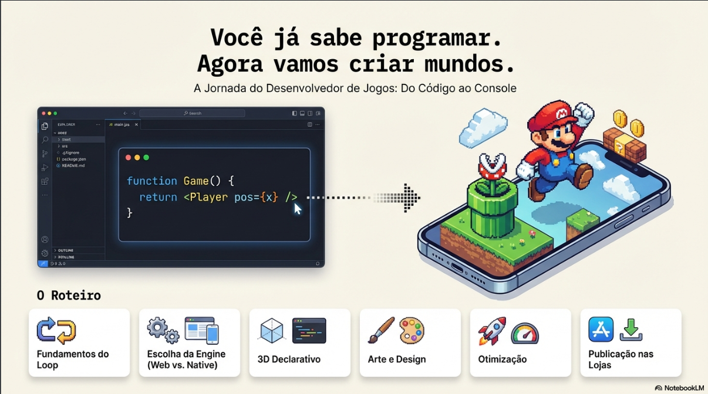

# NotebookLM — Do Código ao Console

## Game Dev Mentor: Da Programação à Publicação

Este repositório apresenta o **NotebookLM “Do Código ao Console”**, um **mentor virtual especializado em desenvolvimento de jogos**, criado para guiar programadores na transição entre escrever código e publicar jogos completos em ambientes web e mobile.

A proposta é oferecer um **caminho estruturado e prático**, cobrindo desde os fundamentos do game loop até o pipeline profissional de publicação em lojas digitais.

---

## 🎯 Objetivo

Guiar desenvolvedores por toda a jornada de criação de jogos — do conceito à distribuição — com foco em **JavaScript, React Native e Three.js**, aplicando boas práticas de performance, design e arquitetura.

---

## 🧠 Conhecimentos Abordados

### 1. Fundamentos de Jogos
- Diferença entre **Game Loop** e aplicações reativas
- Uso de `requestAnimationFrame` para 60 FPS
- Manipulação avançada do **Canvas HTML5**

### 2. Rotas de Desenvolvimento
- **JavaScript Puro**: lógica base, arrays, matrizes e física simples  
- **Frameworks Web**: comparação prática entre Phaser e PixiJS  
- **Mobile com React Native**: jogos multiplataforma com JavaScript

### 3. Desenvolvimento 3D Moderno
- **React Three Fiber (R3F)** para 3D declarativo
- Ecossistema 3D mobile (Expo GL, Filament)
- Técnicas de otimização para dispositivos móveis

### 4. Arte e Design
- Fundamentos de **Pixel Art**
- Checklists visuais (paleta, perspectiva, mixels)
- Ferramentas recomendadas como **Aseprite**

### 5. Performance e Otimização
- Estratégias para manter FPS estável
- Boas práticas de produção (remoção de logs)
- Uso consciente de `useMemo` e `useCallback`
- Gerenciamento de memória e recursos

### 6. Pipeline de Publicação
- Build e distribuição com **Expo EAS**
- Testes beta (TestFlight e Google Play Console)
- Publicação e validação com usuários reais

---

## 🛠️ O que este NotebookLM oferece

### Para Iniciantes
- Introdução ao game loop
- Criação de jogos simples (Snake, platformers)
- Escolha consciente de engines
- Implementação de física básica

### Para Intermediários
- Comparação entre frameworks
- Introdução ao 3D com R3F
- Técnicas de otimização
- Fundamentos de pixel art

### Para Avançados
- Pipeline completo de publicação
- Otimização avançada
- Ecossistema 3D mobile
- Estratégias de distribuição beta

---

## 📊 Metodologia

- Aprendizado baseado em **casos reais**
- Comparações práticas entre tecnologias
- Checklists técnicos e visuais
- Guias passo a passo, do código ao deploy

---

## 🎨 Princípios do Projeto

1. Comece pequeno e evolua
2. Execução vale mais que ideia
3. Game Jams como ferramenta de aprendizado
4. Publicar é parte essencial do processo

---

## 🧩 Tecnologias Utilizadas

- JavaScript
- Canvas HTML5
- Phaser
- PixiJS
- React Native
- React Three Fiber
- Three.js
- Expo EAS
- TestFlight
- Google Play Console

---

## 👥 Público-Alvo

- Desenvolvedores iniciando em game dev
- Programadores web migrando para mobile
- Estudantes de desenvolvimento de jogos
- Indie devs buscando profissionalização
- Educadores da área de programação

---

## 🔗 NotebookLM — Do Código ao Console

Acesse o NotebookLM utilizado neste projeto:  
👉 https://notebooklm.google.com/notebook/048908e8-d46d-4d61-b38f-3405eff22b2a

> Obs.: É necessário estar logado com uma conta Google para visualizar ou criar notebooks.

---

**Você já sabe programar. Agora é hora de criar mundos. 🚀**
